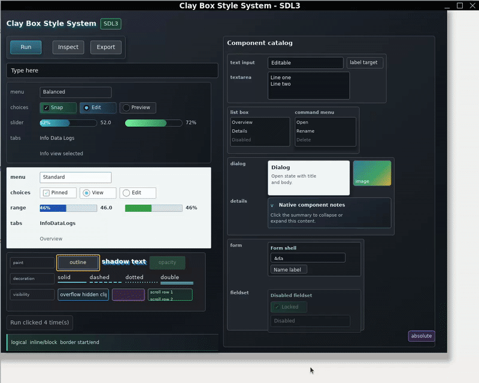
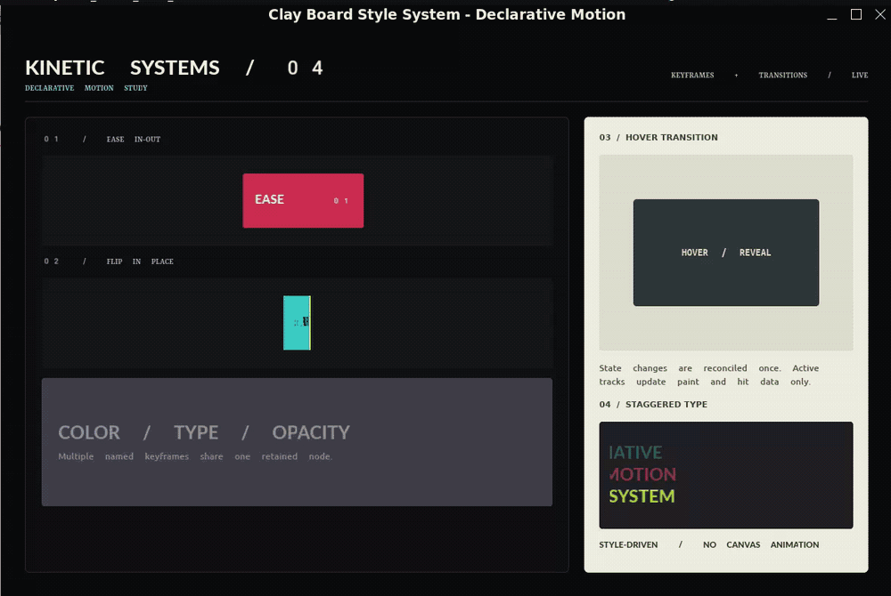

# Clay Board Style System

**The flexibility of CSS. Native performance. A shared foundation for GUI
development.**

[](https://github.com/puffball1567/clay-board-style-system/actions/workflows/ci.yml)
[](LICENSE)

Clay Board Style System is a CSS-inspired primitive engine for building native
GUI toolkits. It gives GUI-library authors one styleable foundation for layout,
text, input, state, accessibility, navigation, and retained Canvas drawing,
instead of making every toolkit rebuild those systems. CBSS runs without a DOM
or WebView, updates only affected work, uses SDL3 for portable native windows
and rendering, and exposes a versioned C ABI for languages beyond Nim.

[](sample/ClayBoardStyleSystem_demo.mp4)

## Why CBSS

- **Familiar to frontend engineers.** Typed Nim APIs use CSS-inspired
  properties, units, box layout, state styling, colors, and transforms.
- **A foundation, not a visual identity.** `Box`, `Text`, `Image`, Canvas, and
  replaceable reference controls let libraries define their own components and
  design systems.
- **Retained and event-driven.** CBSS does not replay every component after an
  event. Dirty domains limit updates, and idle applications block on SDL events.
- **Native behavior in the same model.** Focus, keyboard and pointer events,
  IME, clipboard, scrolling, popups, accessibility semantics, and typed
  navigation are part of the runtime contract.
- **Built for an ecosystem.** Components are ordinary Nim modules with Style
  DI, standard event properties, lifecycle hooks, and no private tag registry.
- **Language-neutral at the boundary.** The append-only C ABI uses opaque
  handles and fixed-layout values rather than exposing Nim-managed objects.

CBSS is not a browser, a WebView wrapper, a complete CSS implementation, or a
finished component library. It is the primitive native UI layer on which those
libraries can be built.

## The API

Components remain ordinary Nim types and `render` procedures, so the compiler
and language server can follow them. There is no TSX parser or virtual DOM.

```nim
import clay_board_style_system

type SaveButton = ref object of CBSSComponent
  label: string

proc saveButtonStyle(): UiStyle =
  uiStyle([
    width(112),
    height(40),
    padding(10),
    decl("background-color", oklch(0.62, 0.16, 250))
  ])

proc render(self: SaveButton) =
  proc onSave(event: DispatchResult): EventOutcome =
    echo "Saved"
    return handledEvent()

  ui.box(self, ownedStyle = saveButtonStyle()):
    ui.text(self.label)

  self.onClick = onSave

let app = initUiRoot()
app.mount(SaveButton(label: "Save"))
```

Typed property helpers make common declarations concise: a bare number in a
dimensional helper expands to pixels, while `percent(...)`, `em(...)`,
`rem(...)`, and viewport-unit constructors preserve explicit intent. The
low-level `decl(...)` API remains available for generated and extension styles.
Closed keyword sets use typed enums, such as `flexDirection(fdRow)` and
`overflow(omAuto)`, instead of requiring stringly typed authoring.

The component owns its behavior and required style. A caller can inject
additional style through the inherited `style` field, while the component wins
when both sides define the same property. See
[Typed Component Authoring](docs/component-authoring.md) for composition,
lifecycle, failure handling, and Style DI.

## Measured Foundation

Performance is a release constraint, not a future slogan. Current ARC release
probes include:

| Workload | Measured result |
| --- | ---: |
| Full cold style pass, 4,000 nodes | 10.648 ms |
| Full cold layout pass, 4,000 nodes | 6.616 ms |
| Full cold paint build, 4,000 nodes | 2.585 ms |
| Full cold hit build, 4,000 nodes | 1.358 ms |
| Flatten 10,000 retained Canvas commands | 2.198 ms average |
| 1,000,000 idle predicates with 10,000 surfaces | 5.690 ms total |

Cold passes are used for initial construction and resize. Interactive updates
are required to remain proportional to dirty work rather than total tree size.
The exact workloads, machine-local interpretation, budgets, and regression
gates are documented in [Performance Model](docs/performance-model.md) and can
be run with `nimble bench`.

The discovered ARC suite currently covers 116 independently compiled test
files. The same suite and public examples also run under ORC as a compatibility
gate, so applications may select either `--mm:arc` or `--mm:orc`. ARC remains
the stricter ownership baseline. Separate Valgrind gates exercise the complete
reference-control graph and both shared and static C ABI consumers.

## Try It

### 1. Requirements

- Nim 2.2 or newer
- Rust and Cargo for the cosmic-text and image bridges
- Linux x86_64 for the current Tier 1 SDL3 runtime

Windows x86_64 and macOS arm64 are continuously checked by the portable CI
suite, but their complete native runtime paths still require contributor
validation.

### 2. Run from a source checkout

```sh
git clone https://github.com/puffball1567/clay-board-style-system.git
cd clay-board-style-system
nimble setupBundled
nimble test
nimble sdl3Demo
```

The focused demos isolate component authoring, Canvas/color behavior, and an
event-driven loading animation. The declarative and Cue motion demos run
real-time keyframes, transitions, and serial/parallel orchestration without
pre-rendered animation:

```sh
nimble componentDemo
nimble v03CanvasDemo
nimble loadingIndicatorDemo
nimble declarativeMotionDemo
nimble orchestrationDemo
nimble validationDemo
nimble cueMotionGraphicsDemo
nimble cueGeometryMotionDemo
nimble popInfographicDemo
nimble kawaiiCompanionDemo
nimble luxuryHotelDemo
```

`cueMotionGraphicsDemo` demonstrates kinetic typography and sequenced visual
stages. `cueGeometryMotionDemo` proves the same public Style and Cue APIs with
only geometry: a gravity-shaped bounce, synchronized shadow, staggered tiles,
and a composed final poster.

`validationDemo` demonstrates retained reactive validation across text,
password, checkbox, cross-field, blur, input, and submit flows. Password inputs
render one mask character per Unicode rune while retaining their typed value
for validation and FormData collection.

`popInfographicDemo` and `kawaiiCompanionDemo` use the same Box, Text, Style,
Canvas, layout, and retained-rendering primitives to demonstrate two
non-administrative application directions. The first is a colorful data story;
the second is a daily companion in a youth-oriented Japanese kawaii visual
language, including a two-head-tall character drawn with retained Canvas
commands rather than a 3D asset.

`luxuryHotelDemo` combines a fictional generated hospitality photograph with
CBSS Image fitting and clipping, layered Style content, serif/sans typography,
reservation details, and concierge panels. Asset provenance is recorded in
`examples/assets/README.md`.

[Kawaii companion screenshot](sample/ClayBoardStyleSystem_kawaii_demo.png) |
[Luxury hotel screenshot](sample/ClayBoardStyleSystem_luxury_hotel_demo.png) |
[Cue motion graphics recording](sample/ClayBoardStyleSystem_cue_motion_graphics_demo.mp4)

[](sample/ClayBoardStyleSystem_declarative_motion_demo.mp4)

Select the preview to open the full MP4 recording.

### 3. Install for an application

```sh
nimble install https://github.com/puffball1567/clay-board-style-system
```

Prepare a runtime directory as described in
[Runtime Linking](docs/runtime-linking.md), then choose a link profile without
changing application imports.

Use an application-supplied SDL3 archive and native bridge runtime:

```sh
cbss_configure bundled /path/to/cbss-runtime
```

Or use SDL3 and bridge libraries installed on the system:

```sh
cbss_configure system
```

The selection is written to the application's ignored `.cbss/` directory.
CBSS does not ship native runtime binaries inside its Nimble package.

## What Version 0.5.0 Contains

- An opt-in frontend runtime with retained typed State, transactional Stores,
  selectors, component-owned watchers and effects, typed asynchronous Commands,
  and dirty-domain invalidation without virtual-DOM replay.
- Typed Cue orchestration with serial and parallel stages, relative timing,
  joins, cancellation, pausable clocks, Signal/State/Store/Command/motion/Canvas
  adapters, lifecycle ownership, and bounded diagnostic tracing.
- Typed synchronous form validation with 40 composable rules, cross-field
  dependencies, six reactive control families, submission gating, invalid
  events, accessibility state, and C ABI invalid-state reporting.
- Typed viewport, font-relative, font-metric-relative, percentage-spacing,
  intrinsic, and property-specific numeric unit authoring with deterministic
  resolution diagnostics.
- Transparent conditional component materialization that preserves normal
  Box/Flex order while empty components consume no layout, paint, hit, focus,
  event, or accessibility space.
- An open event contract with explicit outcomes, stable target/current-target
  identity, replaceable public slots, removable subscriptions, typed signals,
  deterministic default actions, and equivalent C ABI dispatch semantics.
- Immutable Blob and FormData values plus bounded worker-to-UI streams,
  component-owned stream bindings, SDL3 event-loop wakeup, and explicit C ABI
  ownership contracts.
- Declarative paint transitions and multiple named keyframes for opacity,
  foreground/background colors, and typed 2D transforms, including CSS-like
  list cycling, lifecycle events, reduced motion, and active-only scheduling.
- A language-neutral declarative-motion C ABI with copied keyframe builders,
  named registration, time-aware reconciliation, lifecycle events, active-work
  queries, deadlines, cancellation, and ARC/ORC consumer coverage.
- Typed `CBSSComponent` authoring, nested composition, Style DI, lifecycle
  hooks, and transactional mount rollback.
- CSS Color 4-inspired typed and serialized colors, `color-mix()`, wide-gamut
  conversion, and selectable gradient interpolation spaces.
- Retained `Canvas2D` paths, transforms, clips, layers, text, images, gradients,
  local input, frame requests, and a deterministic headless renderer.
- Typed navigation with `Link`, retained screen roots, history, focus
  restoration, external URLs, and application deep links.
- Mouse, touch, pen, keyboard, focus, form, clipboard, IME, drag, scroll, and
  accessibility event contracts.
- Reference controls including button, checkbox, radio, Switch, input,
  textarea, select, slider, details, dialog, progress, tabs, and list box.
- An idle-aware reversible Switch transition and deterministic animation clock
  with reduced-motion support.
- A versioned C ABI for tree, style, layout, paint, input, events, focus,
  scrolling, accessibility, Canvas, diagnostics, and bounded worker-to-UI Blob
  streams.
- Headless unit and E2E tooling, screenshot snapshots, optional real-window
  Wayland scenarios, portable CI, and native memory checks.

The [property support matrix](docs/css-property-support.md) is authoritative.
Accepting a value as metadata does not mean that layout or paint consumes it.

## Current Boundaries

Version 0.5.0 is a developer preview. Public APIs may change before 1.0.

- Linux x86_64 with SDL3 is the only Tier 1 runtime target.
- Windows and macOS native runtime validation is incomplete.
- The semantic accessibility model and platform-neutral AT-SPI adapter exist;
  Linux AT-SPI D-Bus, Windows UIA, and macOS NSAccessibility transports remain
  incomplete.
- Remaining property-specific percentage and intrinsic-sizing combinations,
  inline rich text, additional declarative motion values, filters, 3D
  transforms, CPU effects, and GPU Canvas are roadmap work. Paint transitions
  and multiple named keyframes support opacity, foreground/background colors,
  and typed 2D transforms with CSS-like longhand list cycling.
- CBSS intentionally does not reproduce DOM selectors, browser quirks, legacy
  CSS behavior, JavaScript, or a browser security model.

See the [Product Roadmap](docs/roadmap.md) for the complete dependency order.

## Architecture

The core pipeline is retained and renderer-oriented:

```text
Node tree
  -> style resolution
  -> layout
  -> paint commands
  -> hit regions
  -> renderer backend
```

The core primitives are `Box`, `Text`, and `Image`. Canvas and RenderSurface
provide bounded custom drawing inside ordinary layout. Reference controls are
compositions that validate behavior; GUI libraries may use, restyle, replace,
or ignore them.

Independent packages can build higher layers without changing CBSS core:

```text
CBSS
  style, layout, text, events, semantics, Canvas, rendering contracts

GUI and visualization libraries
  design systems, grids, charts, editors, game UI, domain components

Applications
  product state, business logic, persistence, networking, backend services
```

State changes update stable nodes and mark the affected dirty domains. CBSS
does not use React-style component replay as its performance strategy. Timed
work requests frames explicitly; an idle host can block in `SDL_WaitEvent`.

## CSS-Inspired, Not CSS

CBSS uses familiar property names, units, colors, flex and box concepts, and
state styling because they provide a productive UI vocabulary. The authored
values are typed Nim data, not browser stylesheet text.

CBSS does not promise:

- CSS source compatibility
- a DOM or document cascade
- descendant or structural selector matching
- browser default stylesheets
- bug-for-bug browser rendering
- legacy browser layout models

Unlike CSS, CBSS also owns native UI behavior such as typed `onClick`,
`onChange`, `onInput`, keyboard, pointer, focus, composition, and lifecycle
APIs. Application business logic remains ordinary Nim or an external service.

## Language-Neutral C ABI

The public C boundary uses opaque handles, fixed-layout values, explicit
ownership, status codes, and append-only enums. Nim strings, sequences,
references, exceptions, and object layouts do not cross the ABI. Immutable
Blob handles support both bounded eager snapshots and host-authorized lazy
providers, so foreign files, mappings, and decoders can participate without
exposing raw ownership to CBSS. The same boundary exposes copied named
keyframes, declaration-driven transitions, monotonic motion advancement,
frame deadlines, dirty domains, reduced-motion control, and lifecycle events.

```sh
nimble buildCAbiShared
nimble buildCAbiStatic
nimble testCAbi
```

Applications can wrap `include/cbss.h` from C, C++, Rust, Zig, Swift, or another
language with C interoperability. See [C ABI Guide](docs/c-api.md) for
construction, ownership, callbacks, versioning, and static/shared linking.

C++14 applications can use the higher-level reference Craft Driver in
[`drivers/cpp`](drivers/cpp/README.md). It provides RAII ownership, typed Style
values, capability negotiation, and scoped nested UI construction while using
the same C ABI engine underneath.

## Documentation

| Topic | Document |
| --- | --- |
| Product direction | [Roadmap](docs/roadmap.md) |
| Craft components, styles, packs, and drivers | [Craft Ecosystem](docs/craft.md) |
| Architecture and boundaries | [Architecture](docs/architecture.md) |
| API stability and deprecation | [API Stability](docs/api-stability.md) |
| Performance budgets | [Performance Model](docs/performance-model.md) |
| Components and Style DI | [Component Authoring](docs/component-authoring.md) |
| State, effects, Commands, and Cue | [Frontend Runtime Design](docs/frontend-runtime.md) |
| Forms and reactive validation | [Form Validation Design](docs/form-validation.md) |
| Events and typed signals | [Events](docs/events.md) |
| Blob, FormData, and Streams | [UI Data Interchange](docs/data-interchange.md) |
| Canvas and custom drawing | [Render Surfaces](docs/render-surfaces.md) |
| SDL3, CPU vector, bgfx, and color management | [Native Rendering Stack](docs/native-rendering-stack.md) |
| Optional platform primitive candidates | [Platform Primitives](docs/platform-primitives.md) |
| Navigation and Link | [Navigation](docs/navigation.md) |
| Color model | [Color](docs/color.md) |
| Accessibility | [Accessibility](docs/accessibility.md) |
| Property coverage | [CSS Property Support](docs/css-property-support.md) |
| Runtime setup | [Runtime Linking](docs/runtime-linking.md) |
| Platform status | [Platform Support](docs/platform-support.md) |
| Contribution boundaries | [Contributing](CONTRIBUTING.md) |

## Development

```sh
nimble test
nimble testOrc
nimble checkExamples
nimble checkExamplesOrc
nimble bench
nimble testMotionAsan
nimble testUbsan
nimble testLsan
nimble testTsan
nimble testWidgetLifecycleValgrind
nimble testCAbiValgrind
```

The full test tasks discover and independently compile the suite under ARC and
ORC. CI also checks portable public modules on Linux, Windows, and macOS,
builds shared and static C ABI artifacts, tests both Rust bridges, verifies
source-only package installation, and runs release hygiene checks. Declarative
motion tests run under AddressSanitizer with ARC and ORC on Linux, Windows, and
macOS. UndefinedBehaviorSanitizer covers Linux and macOS; ThreadSanitizer covers
the same two systems. Standalone LeakSanitizer and Valgrind run on Linux. Other
platform combinations are omitted when their sanitizer runtime cannot be
reliably linked and maintained with the CI toolchain.

Read [CONTRIBUTING.md](CONTRIBUTING.md) before changing a public boundary or hot
path. Properties, elements, backends, and reference controls are separated so
contributors can work without editing unrelated modules.

## Memory Verification

The current ARC widget probe completes 16 full root lifecycles with 33,201
allocations and 33,201 frees. Valgrind reports:

```text
in use at exit: 0 bytes in 0 blocks
ERROR SUMMARY: 0 errors from 0 contexts
```

The probe covers all reference controls, internal and replaced handlers,
component mount and disposal, animations, popup closers, focus, clipboard, and
text composition. Shared and static C ABI consumers have separate lifecycle
gates. Valgrind complements the three-platform AddressSanitizer matrix and
platform integration tests; it does not replace them and is not presented as a
portable Windows or macOS verifier. UndefinedBehaviorSanitizer checks numeric,
layout, transform, and motion paths on Linux and macOS. ASan's integrated
LeakSanitizer checks retained lifecycles on Linux, while ThreadSanitizer checks
worker-to-UI stream ownership on Linux and macOS. Each sanitizer task runs under
both ARC and ORC. Windows is covered by the portable suite and ASan instead of
an unverified UBSan runtime. Sanitizer runtimes are test-only and are never
linked into release or application artifacts.

| Verification | Linux | Windows | macOS |
| --- | --- | --- | --- |
| Portable tests and type checks | Yes | Yes | Yes |
| LLVM AddressSanitizer | ARC + ORC | ARC + ORC | ARC + ORC |
| LLVM UndefinedBehaviorSanitizer | ARC + ORC | No (portable + ASan) | ARC + ORC |
| ASan-integrated LeakSanitizer | ARC + ORC | No (Linux leak gates) | No (Linux leak gates) |
| LLVM ThreadSanitizer | ARC + ORC | No (Unix TSan gates) | ARC + ORC |
| Valgrind lifecycle and C ABI | ARC | No (Linux gate) | No (Linux gate) |

Additional sanitizer tasks accept `CBSS_CLANG` when a specific compiler binary
is required. CI pins Linux to `clang-18`; local runs otherwise use `clang` from
`PATH`.

## Name And License

The name describes the intended ecosystem. CBSS is the board or foundation;
independent GUI libraries, components, and design systems are the work that
other engineers shape on it.

Clay Board Style System is an independent project. It is not related to,
affiliated with, derived from, or compatible with Clay, the C UI layout
library. `CBSS` is only the short form used in documentation.

CBSS is licensed under the [Apache License 2.0](LICENSE). Vendored and
dynamically linked dependency notices are recorded in
[THIRD_PARTY_NOTICES.md](THIRD_PARTY_NOTICES.md).
